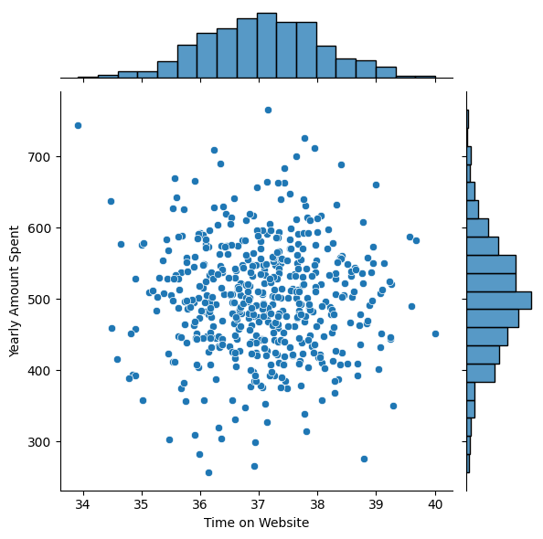
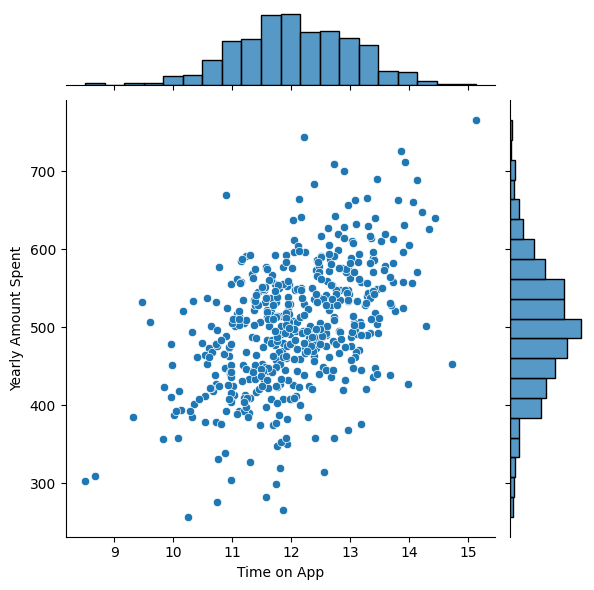
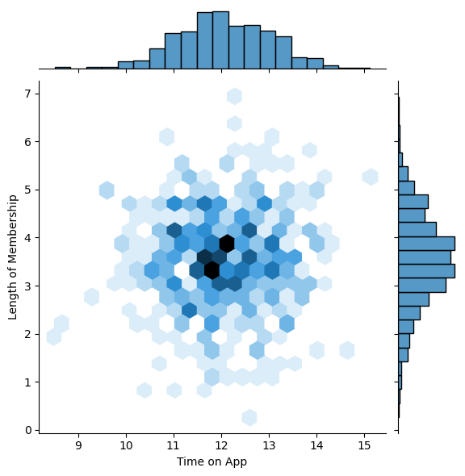
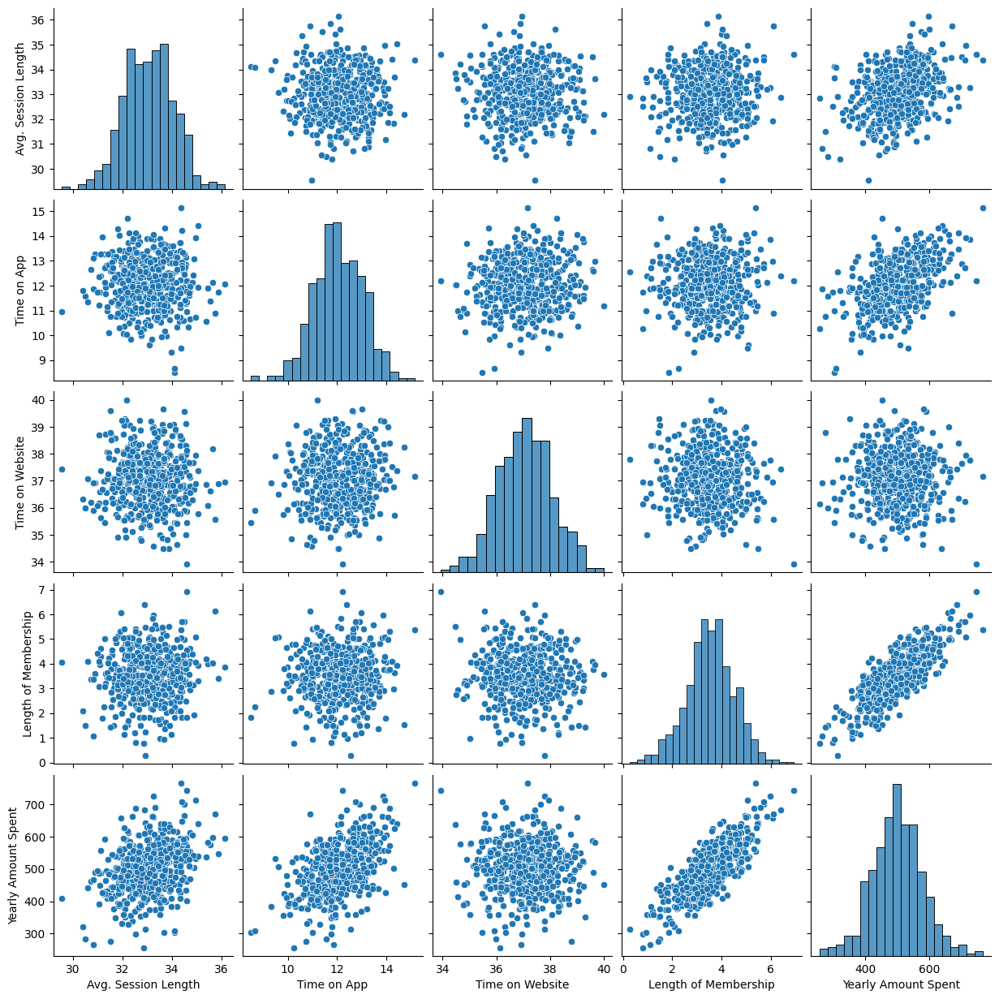
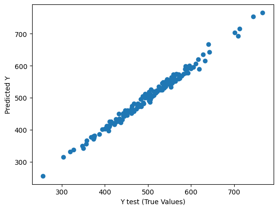
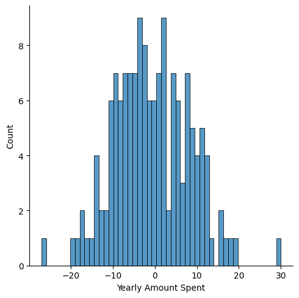

# Ecommerce Data

Problem:

An Ecommerce company based in New York City that sells clothing online but they also have in-store style and clothing advice sessions. Customers come in to the store, have sessions/meetings with a personal stylist, then they can go home and order either on a mobile app or website for the clothes they want.

The company is trying to decide whether to focus their efforts on their mobile app experience or their website.

Note: This dataset was synthetic. Real data for projects like this is proprietary to companies and businesses. However, the problem itself is realistic, and this is my approach to solving it.

## EDA

**Data Head**

<table border="1" class="dataframe">
  <thead>
    <tr style="text-align: right;">
      <th></th>
      <th>Email</th>
      <th>Address</th>
      <th>Avatar</th>
      <th>Avg. Session Length</th>
      <th>Time on App</th>
      <th>Time on Website</th>
      <th>Length of Membership</th>
      <th>Yearly Amount Spent</th>
    </tr>
  </thead>
  <tbody>
    <tr>
      <th>0</th>
      <td>mstephenson@fernandez.com</td>
      <td>835 Frank Tunnel\nWrightmouth, MI 82180-9605</td>
      <td>Violet</td>
      <td>34.497268</td>
      <td>12.655651</td>
      <td>39.577668</td>
      <td>4.082621</td>
      <td>587.951054</td>
    </tr>
    <tr>
      <th>1</th>
      <td>hduke@hotmail.com</td>
      <td>4547 Archer Common\nDiazchester, CA 06566-8576</td>
      <td>DarkGreen</td>
      <td>31.926272</td>
      <td>11.109461</td>
      <td>37.268959</td>
      <td>2.664034</td>
      <td>392.204933</td>
    </tr>
    <tr>
      <th>2</th>
      <td>pallen@yahoo.com</td>
      <td>24645 Valerie Unions Suite 582\nCobbborough, D...</td>
      <td>Bisque</td>
      <td>33.000915</td>
      <td>11.330278</td>
      <td>37.110597</td>
      <td>4.104543</td>
      <td>487.547505</td>
    </tr>
    <tr>
      <th>3</th>
      <td>riverarebecca@gmail.com</td>
      <td>1414 David Throughway\nPort Jason, OH 22070-1220</td>
      <td>SaddleBrown</td>
      <td>34.305557</td>
      <td>13.717514</td>
      <td>36.721283</td>
      <td>3.120179</td>
      <td>581.852344</td>
    </tr>
    <tr>
      <th>4</th>
      <td>mstephens@davidson-herman.com</td>
      <td>14023 Rodriguez Passage\nPort Jacobville, PR 3...</td>
      <td>MediumAquaMarine</td>
      <td>33.330673</td>
      <td>12.795189</td>
      <td>37.536653</td>
      <td>4.446308</td>
      <td>599.406092</td>
    </tr>
  </tbody>
</table>

**Summary Statistics**

<table border="1" class="dataframe">
  <thead>
    <tr style="text-align: right;">
      <th></th>
      <th>Avg. Session Length</th>
      <th>Time on App</th>
      <th>Time on Website</th>
      <th>Length of Membership</th>
      <th>Yearly Amount Spent</th>
    </tr>
  </thead>
  <tbody>
    <tr>
      <th>count</th>
      <td>500.000000</td>
      <td>500.000000</td>
      <td>500.000000</td>
      <td>500.000000</td>
      <td>500.000000</td>
    </tr>
    <tr>
      <th>mean</th>
      <td>33.053194</td>
      <td>12.052488</td>
      <td>37.060445</td>
      <td>3.533462</td>
      <td>499.314038</td>
    </tr>
    <tr>
      <th>std</th>
      <td>0.992563</td>
      <td>0.994216</td>
      <td>1.010489</td>
      <td>0.999278</td>
      <td>79.314782</td>
    </tr>
    <tr>
      <th>min</th>
      <td>29.532429</td>
      <td>8.508152</td>
      <td>33.913847</td>
      <td>0.269901</td>
      <td>256.670582</td>
    </tr>
    <tr>
      <th>25%</th>
      <td>32.341822</td>
      <td>11.388153</td>
      <td>36.349257</td>
      <td>2.930450</td>
      <td>445.038277</td>
    </tr>
    <tr>
      <th>50%</th>
      <td>33.082008</td>
      <td>11.983231</td>
      <td>37.069367</td>
      <td>3.533975</td>
      <td>498.887875</td>
    </tr>
    <tr>
      <th>75%</th>
      <td>33.711985</td>
      <td>12.753850</td>
      <td>37.716432</td>
      <td>4.126502</td>
      <td>549.313828</td>
    </tr>
    <tr>
      <th>max</th>
      <td>36.139662</td>
      <td>15.126994</td>
      <td>40.005182</td>
      <td>6.922689</td>
      <td>765.518462</td>
    </tr>
  </tbody>
</table>

**Comparing the Time on Website and Yearly Amount Spent**

There doesn't appear to be any relationship between the Yearly Amount Spent and Time on the Website. Both distributions seem to have a bell shape.

**Comparing Time on App with Yearly Amount Spent**

There seems to be a strong positive correlation between Yearly Amount Spent and Time on App.

**Using a jointplot to create a 2D hex bin plot comparing Time on App and Length of Membership.**

**exploring types of relationships across the entire data set using a pairplot**

Length of Membership and Time on App seem to be the most correlated feture with Yearly Amount Spent.

## Model Fitting

The data was split into training and testing, and a linear regression model was fit using SKlearn. The features used where Avgerage Session Length, Time on App, Time on Website, Length of Membership.

These are the coefficients:

| Feature                | Coefficient |
|------------------------|-------------|
| Average Session Length | 25.982      |
| Time on App            | 38.590      |
| Time on Website        | 0.190       |
| Length of Membership   | 61.279      |

**A scatterplot of the real test values versus the predicted values**

Visually we can see that the model fits the data well. There is some noise.

## Model Evaluation 

**Evaluating the model performance by calculating the residual sum of squares and the explained variance score (R^2)**

| Metric | Value |
|--------|-------|
| MAE    | 7.228 |
| MSE    | 79.813 |
| RMSE   | 8.934 |
| R^2    | 0.989 |

The model explains 99% of variance

**Exploring residuals to make sure everything was okay with our data**

**Histogram of the residuals**

We see the residuals are very close to a standard normal distribution. This distribution is what we want, as it's one of the assumptions of a linear regression model.

## Conclusion

Answering the the business question: Do you think the company should focus more on their mobile app or on their website?*

You could look at it in different ways:

1. Since the app is already working well,  it would be better to develop the website to make the experience of using the website as good as the experience of using the mobile app. Since the website needs the most work, the company should focus its efforts there.

2. Develop the app more; since you know, the app is working well, keep improving the experience on the app. 

It would be better to do more analysis and look at the business side to decide which approach to take. For example, look at the costs of each approach. Collecting more data or exploring different relationships would be best before deciding what to do. 

